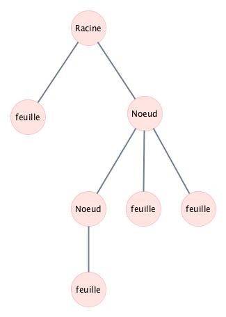
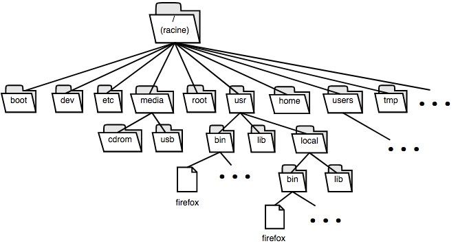
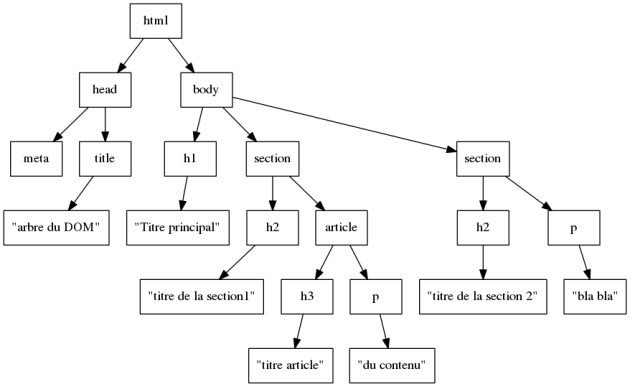
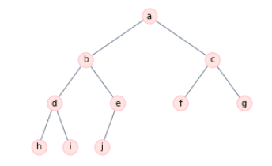

# Structures de données récursive :  les arbres

## Introduction

Un organisateur de tournoi de rugby recherche la meilleure solution pour afficher les potentiels quarts de final, demi-finales et finale: 

Au départ nous avons 4 poules de 4 équipes. Les 4 équipes d'une poule s'affrontent dans un mini championnat (3 matchs par équipe). À l'issue de cette phase de poule, les 2 premières équipes de chaque poule sont qualifiées pour les quarts de finale. 

On connaît les 2 qualifiés par poule : 

* Poule 1 => 1er Eq1 et 2e Eq8 
* Poule 2 => 1er Eq2 et 2e Eq7 
* Poule 3 => 1er Eq3 et 2e Eq6 
* Poule 4 => 1er Eq4 et 2e Eq5 

En quart de final on va avoir : 

- quart de finale 1 => Eq1 contre Eq5 
- quart de finale 2 => Eq2 contre Eq6 
- quart de finale 3 => Eq3 contre Eq7 
- quart de finale 4 => Eq4 contre Eq8 

Pour les demi-finales on aura : 

- demi-finale 1 => vainqueur quart de finale 1 contre vainqueur quart de finale 3 
- demi-finale 2 => vainqueur quart de finale 2 contre vainqueur quart de finale 4 

L'organisateur du tournoi affiche les informations ci-dessus le jour du tournoi. Malheureusement, la plupart des spectateurs se perdent quand ils cherchent à déterminer les potentielles demi-finales (et ne parlons pas de la finale !) 

Comment faire ? naturellement, comment auriez-vous envie de représenter cette masse d’informations ?

??? check "exemple de structure possible"
    


# 1.	Définitions
Un arbre en informatique est un type particulier de **graphe**. Comme nous n'avons pas encore vu à ce stade de l'année les graphes, cette définition n'est pas d'une grande utilité...

{width=30% align=right}
On dira donc qu'un arbre est constitué :

-	D’une **racine**, sommet de "départ" de l'arbre 
-	De **nœuds**, sommets intermédiaires de l'arbre 
-	De **feuilles**, sommets "finaux" de l'arbre 
-	Et de **branches**, qui relient les éléments précédents entre eux

Les arbres informatiques ont ceci de particulier qu'ils poussent tête en bas. Les arbres sont des structures de données hiérarchiques, très utilisées en informatique. Ils sont orientés : la représentation standardisée, racine en haut, indique la relation "père-enfant" entre les sommets. Lorsque deux sommets sont reliés par une branche, celui du haut est le père, et celui du bas est l’enfant. Un père peut avoir plusieurs enfants, mais un enfant ne peut pas avoir plusieurs pères (faites un dessin, on obtiendrait alors ce qu’on appelle un cycle dans le vocabulaire des graphes).

_Question_ : Citez des exemples de représentation arborescente que vous connaissez.

??? check "Réponses possibles"
    un arbre généalogique, Une arborescence de fichiers, Un document HTML
    {width=50% align=right}
    {width=50%}
    
  
## Définitions complémentaires

-	Les **nœuds** sont en général étiquetés, ci-contre les étiquettes sont les lettres a, b, c, etc…
-	La **taille** d’un arbre est le **nombre de ses nœuds**. Dans l’exemple ci-dessus, la taille de l’arbre est 7.
-	La **hauteur** (ou profondeur ou niveau) d’un nœud X est définie comme le **nombre de nœud à parcourir pour aller de la racine au nœud X**. La hauteur de la racine est arbitrairement fixée à 1, ou 0 suivant les définitions. Pour la suite du cours, nous choisirons la hauteur de la racine égale à 1.
-	La **hauteur de l’arbre** est la plus grande des hauteurs de ses noeuds

Exemple : 

- le nœud ⓒ a pour hauteur 2 
- le nœud ⓕ a pour hauteur 3
- le nœud ⓖ a pour hauteur 3 (avec 1 comme hauteur pour a)
- la hauteur de l’arbre est égale à la hauteur du nœud ⓖ, soit 3.

Un arbre peut être défini de manière récursive : 

: :arrow_right: un arbre est soit un arbre vide
: :arrow_right: une racine **et** une liste de sous-arbres (éventuellement vide, auquel cas c’est une feuille). 
C’est la définition qui est probablement la plus pertinente pour la vision « informatique » des arbres.

En terminale, nous étudierons principalement les arbres binaires : 

**un arbre binaire est un arbre dont tous les nœuds sont d’arité au maximum 2.**

Autrement dit, chaque père a aux plus deux enfants, appelés sous-arbre gauche et sous-arbre droit.
Un arbre binaire est soit un arbre vide, soit une racine, un sous-arbre Gauche et un sous-arbre Droit. Il est essentiel de comprendre qu'un sous-arbre **est** un arbre. D'où la définition récursive ci dessus. 
Les arbres binaires se rencontrent par exemple dans les compétitions sportives comme un tournoi de tennis.

### Trois cas particuliers :
 
??? danger "Arbre dégénéré ou filiforme	 ou arbre peigne"
    Un arbre binaire peigne est un cas particulier extrême d'arbre binaire, tous les nœuds intérieurs ont un seul enfant qui est non vide, et toujours du même côté. Techniquement c'est une liste chainée.
    

??? danger "Arbre parfait"
    Un arbre binaire parfait possède des nœuds intérieurs qui ont tous exactement deux enfants non vides. C'est l'arbre idéal pour certains algorithmes... Une taille maximale pour une hauteur minimale.   
    

??? danger "Arbre complet ou presque complet" 
    c’est un arbre dont tous les niveaux sont complètement remplis, sauf éventuellement le dernier. Les feuilles du dernier niveau sont le plus à gauche possible
    

???+ attention
    A noter que ces définitions varient suivant les auteurs et les livres ! notamment «parfait» et «complet» peuvent être intervertis !

### Lien entre taille et hauteur. 
Si un arbre binaire est de taille ```n``` et de hauteur ```h```, alors : 

-	le nombre de sommets est au moins égal à la hauteur, et strictement inférieur à $2^h$ :
    $h <= n < 2^h$
-	De manière équivalente, la hauteur est strictement plus grande que le logarithme en base deux de la taille, et inférieur ou égal à la taille : $\log _{2} n < h <= n$


_Question_ : Dessiner tous les arbres binaires ayant respectivement 3 et 4 nœuds

??? check "Réponse"
    Il y a 5 arbres binaires possédant 3 noeuds
    
    Il y a 14 arbres binaires possédant 5 noeuds
    

_Question_ :  calculer le nombre de d’arbres binaires contenant 5 nœuds. Sachant qu’il y a 

- 1 arbre binaire vide
- 1 arbre binaire contenant 1 nœud
- 2 arbres binaires contenant 2 nœuds
- 5 arbres binaires contenant 3 nœuds
-  14 arbres binaires contenant 4 nœuds

On ne cherchera pas à les construire tous, mais seulement à les dénombrer

 ??? check "Réponse"
    Pour les dénombrer, on considère le noeud à la racine puis on répartit les quatres noeuds restants entre le sous-arbre gauche et le sous-arbre droit. Par exemple, on peut mettre un noeud dans le sous-arbre gauche et 3 dans le sous-arbre droit.
    Au total, il y a 5 façons différentes de répartir les noeuds $(0+4, 1+3, 2+2, 3+1, 4+0)$.
    Pour chacune, on connaît le nombre de sous-arbres possibles, ce qui donne la somme :
    <center>$1*14 + 1*5 + 2*2 + 5*1 + 14*1$</center>
    Soit un total de **42** arbres binaires possédant 5 noeuds

### Mise en application débranché

[Lien vers les exercices](https://sofaugeras.github.io/TNSI/T1_Structures_de_donnees/1.3_arbres/Exercices/)


2.	Une classe arbre binaire en Python

Lien vers le notebook  [ici](https://nbviewer.org/urls/sofaugeras.github.io/TNSI/site/T1_Structures_de_donnees/1.1_Listes_Piles_Files/01_Listes_Piles_Files.ipynb){target=_blank}  [:fontawesome-solid-download:](https://sofaugeras.github.io/TNSI/docs/T1_Structures_de_donnees/1.1_Listes_Piles_Files/01_Listes_Piles_Files.ipynb){ .md-button .md-button--primary} 

Le but est de créer une structure de données pour représenter un arbre binaire en Python. Les opérations sur les arbres binaires sont au minimum :
•	Construction d’arbre vide
•	Construction d’un arbre à partir d’un entier et de deux sous-arbres gauche et droit
•	Test de vacuité
•	Accès à la racine d’un arbre
•	Accès au sous-arbre gauche
•	Accès au sous-arbre droit

a.	Première implémentation
On crée une classe nœud, puis on utilise ce nœud pour construire un arbre
class Noeud:
    def __init__(self,valeur,gauche,droit):
        self.n = valeur
        self.g = gauche
        self.d = droit

class ArbreBinaire:
    def __init__(self,c):
        self.r = c
        
    def creeVide():
        return ArbreBinaire(None)
    
    def creeNGD(valeur, gauche = None, droit = None):
        return ArbreBinaire(Noeud(valeur, gauche, droit))
    
    def estVide(self):
        return self.r is None
    
    def racine(self):
        assert not(self.r is None),'Arbre vide'
        # Deuxième version
        # if self.estVide():
   #     Raise index error('Arbre vide')
        # else : 
        return self.r.n
    
    def filsGauche(self):
        assert not(self.r is None),'Arbre vide'
        return self.r.g
    
    def filsDroit(self):
        assert not(self.r is None),'Arbre vide'
        return self.r.d

b.	Deuxième implémentation
Comme vu dans le notebook, la classe nœud suffit à créer un arbre, qui n’est rien d’autre qu’une suite récursive de nœuds. La classe ArbreBinaire du paragraphe précédent n’est donc pas obligatoire.

3.	Algorithmes sur les arbres
Ces algorithmes sont à comprendre plus qu’à retenir
a.	Taille et hauteur
Calcul de la taille : retourne le nombre de sommets de l’arbre (racine + nœuds + feuilles)
Fonction récursive taille(arbre) :
Si arbre est vide
Retourner 0
Sinon
Retourner 1 + taille (fils gauche) + taille (fils droit)

Calcul de la hauteur : retourne la hauteur de l’arbre
Fonction récursive hauteur(arbre) :
Si arbre est vide
Retourner 0
Sinon
Retourner 1 + max( hauteur (fils gauche), hauteur(fils droit))
b.	Parcours en profondeur
Dans le parcours en profondeur, on parcourt d’abord la racine de l’arbre, puis récursivement les enfants gauche et droit. L’ordre dans lequel est fait ce traitement donne les trois parcours possibles :

i.	Parcours préfixe : racine – gauche – droit (la racine avant les enfants, la racine précèdent)
ii.	Parcours infixe : gauche – racine – droit (la racine est au milieu, « in »)
iii.	Parcours suffixe : gauche – droit – racine (la racine est en dernier, la racine succède)

Préfixe	Infixe	Suffixe (postfixe)
Fonction visitePréfixe(arbre) :
    Si arbre n’est pas vide :
         visiter racine
         visitePréfixe (fils gauche) 
         visitePréfixe (fils droit)	Fonction visiteInfixe(arbre) :
    Si arbre n’est pas vide :
         visiteInfixe (fils gauche) 
         visiter racine
         visiteInfixe (fils droit)	Fonction visiteSuffixe(arbre) :
    Si arbre n’est pas vide :
         visiteSuffixe (fils gauche) 
         visiteSuffixe (fils droit)
         visiter racine


c.	Parcours en largeur
Principe : on parcourt tous les nœuds de hauteur 1 (la racine), puis tous les nœuds de hauteur 2, ceux de hauteur 3 etc. Le parcours se fait en général de gauche à droite.
On utilise pour cela une file
Étapes de l'algorithme : 
1 .	Mettre le nœud source dans la file.
2.	Retirer le nœud du début de la file pour le traiter.
3.	Mettre le fils gauche et le fils droits lorsqu’ils sont non vides, non explorés, à la fin de la file.
4.	Si la file n'est pas vide reprendre à l'étape 2.


4.	Arbres binaires de recherche (ABR)
a.	Définition
Un arbre binaire de recherche, ou ABR, est un arbre binaire étiqueté possédant la propriété suivante :
Pour tout nœud x, tous les nœuds situés dans le sous-arbre gauche de x ont une valeur inférieure ou égale à celle de x, et tous les nœuds situés dans le sous-arbre droit ont une valeur supérieure ou égale à celle de x.

Les arbres binaires de recherche servent, comme leur nom l’indique, à rechercher rapidement des éléments ordonnés.
Exemples :
 	 
Est un arbre binaire de recherche	N’est pas un arbre binaire de recherche
 
b.	Algorithmes sur les ABR
i.	Recherche dans un ABR
Principe : suivant la valeur à rechercher, et la valeur du nœud sur lequel on est, on cherche soit dans le sous-arbre gauche, soit dans le sous-arbre droit

Fonction récursive recherche(ABR, valeur) :
Si ABR est vide
Retourner None			# variante : retourner Faux
Sinon
valeur(x)  = étiquette(ABR)		# valeur de la racine
Si valeur < valeur(x) :
Retourner recherche(fils_gauche , valeur)
Sinon si valeur > valeur(x) :
Retourner recherche(fils_droit , valeur)
Sinon 
Retourner ABR		# variante : retourner Vrai

Pseudo-définition (peu rigoureuse et incomplète) : un arbre est équilibré si les hauteurs entre les sous-arbres gauche et droit sont différentes de 1 au maximum. Les arbres complets ou parfaits sont équilibrés.
 	 
Arbre binaire de recherche équilibré (tout en étant ni parfait, ni complet)	Arbre binaire de recherche déséquilibré. Cet arbre contient les mêmes données que celui de gauche.

Complexité :
Si l’arbre binaire de recherche est équilibré, alors le coût en temps de la recherche est en  , où n est le nombre de nœuds de l’arbre.
Dans le cas ou l’arbre binaire de recherche n’est pas équilibré, la recherche est en   . Le cas le pire étant le cas ou l’ABR est filiforme.
Remarque : on peut écrire une version itérative de cet algorithme (exercice intéressant)

ii.	Insertion dans un ABR
Le problème de l’insertion dans un ABR correspond à celui de la construction de l’ABR. L’insertion dans un ABR commence par la recherche de l’endroit où l’on doit insérer la valeur. Si la valeur à insérer est plus petite –ou égale– que la valeur du nœud, on va à gauche, si elle est plus grande on va à droite. On arrive à un moment à un arbre vide : c’est là où on ajoute la nouvelle valeur. La gestion des arbres vides n’est cependant pas si simple dans cette approche.

Fonction récursive ajoute(ABR, valeur) :

Si ABR est vide
ABR = Arbre(valeur, None, None)
Sinon si valeur <= étiquette_noeud(ABR)	
ajoute(fils_gauche , valeur)
Sinon 
ajoute(fils_droit , valeur)

Complexité : la complexité est identique à celle de la fonction de recherche. Dans le cas d’un arbre équilibré, elle est en  .
Remarque : cette méthode ne donne pas forcément des arbres équilibrés. Pour avoir un arbre équilibré, une méthode efficace est d’insérer les éléments dans un ordre aléatoire.

iii.	Suppression dans un ABR 
Cette partie n’est pas au programme du bac. Elle constitue un complément enrichissant en vitamines pour les neurones.
Le problème se décompose en trois cas, suivant le nombre de fils du nœud à supprimer.
Si le nœud est une feuille (pas de fils), alors on supprime simplement le lien du père vers ce nœud (on décroche le nœud). Si ce lien n’existe pas, l’arbre devient l’arbre vide.
 	 

Si le nœud a un seul fils, alors on décroche le nœud comme précédemment, et on remplace son fils dans le nœud père. Si le père n’existe pas, le nœud fils devient la racine de l’arbre.

  
Si le nœud a deux fils, on cherche dans le sous-arbre gauche le nœud MaxLocal de valeur la plus grande (ou le nœud de valeur la plus petite dans le sous-arbre droit). La valeur de ce nœud va remplacer la valeur supprimée. Comme ce nœud MaxLocal a la valeur maximale dans le sous-arbre gauche, il n’a pas de fils droit. On peut donc le décrocher, comme on l’a fait dans le cas précédent.
 	 

---
## Bibliographie
-	Cours de Frédéric Mandon 
-	Gilles Lassus – Enseignant NSI  Lycée François Mauriac --  Bordeaux 
-	NSI 24 Leçons avec exercices corrigés – Edition Ellipses
-	Prépabac NSI, Terminale, G.CONNAN, V.PETROV, G.ROZSAVOLGYI, L.SIGNAC, éditions HATIER.
- Numérique et Sciences Informatiques, Terminale, T. BALABONSKI, S. CONCHON, J.-C. FILLIATRE, K. NGUYEN, éditions ELLIPSES.
---
