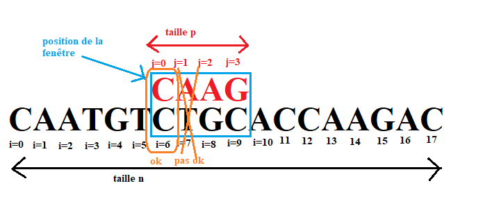
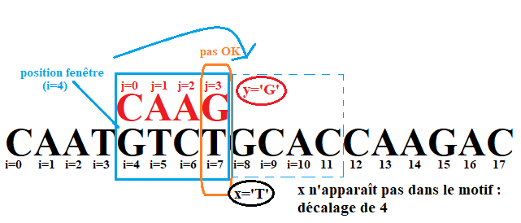
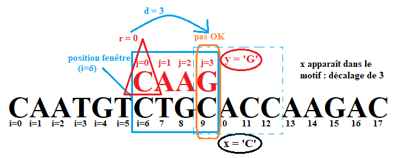

# Recherche textuelle
{: .center width=70%}

{: .center width=70%}

<!--
<gif-player src="https://glassus.github.io/terminale_nsi/T3_Algorithmique/3.3_Recherche_textuelle/data/gif_naive.gif" speed="1" play></gif-player>

-->

## 1. Recherche naïve

???+ tip "Illustration de l'algorithme"
    <gif-player src="https://glassus.github.io/terminale_nsi/T3_Algorithmique/3.3_Recherche_textuelle/data/gif_naive.gif" speed="1" play></gif-player>

    _Vous pouvez contrôler le déroulement de l'animation en la survolant avec la souris._

### 1.0 Cadre du probléme 

Dans toute la suite on cherche donc la première occurrence d’un <font color='blue'>*motif*</font> de longueur $p$ dans un <font color='blue'>*texte*</font> de longueur $n$.


À un moment donné de la recherche, on observe une <font color='blue'>*fenêtre*</font> de taille `p` du texte complet, sur laquelle on aligne le motif, et on regarde s'il y a bien correspondance.

{: .center width=70%}

Dans ce schéma, la fenêtre est positionnée en `i=6`. Les caractère du motif sont indicés par `j` tandis que ceux du texte sont indicés par `i`.

Pour voir si on a trouvé un <font color='blue'>*motif*</font>, on doit comparer les caractères du motif à ceux qui leur font face dans le texte.

:arrow_forward: Pour chaque caractère du <font color='blue'>*motif*</font>, on va comparer `motif[j]` à `texte[i:j]` avec Les caractères du texte présents dans la fenêtre numérotés de 0 à `p-1`</font>


:ok: Si la fenêtre présente un défaut de correspondance entre les caractères du texte et ceux du motif, on déplace la fenêtre. Si le motif correspond parfaitement au texte dévoilé dans la fenêtre, on a trouvé une occurrence à la position `i`.

:asterisk: Précondition : pour que la recherche puisse se faire, on doit avoir l'inégalité $0 < len(motif) < len(texte)$, autrement exprimé ici `0 < p < n`


### 1.1 Premier algorithme

On balaye la fenêtre de gauche à droite et on teste si chaque caractère correspond. Si ce n’est pas le cas, on décale la fenêtre de 1 vers la droite.

Ici : échec de la correspondance pour j = 1

{: .center width=60%}

Donc décalage de la fenêtre d’un cran vers la droite

{: .center width=60%}

!!! note "Algorithme de recherche naïve :heart:"

    ```python linenums='1'
        def recherche_naive(texte, motif):
            '''
            renvoie la liste des indices (éventuellement vide) des occurrences de
            de la chaîne motif dans la chaîne texte.
            '''
            indices = []
            i = 0
            while i <= len(texte) - len(motif):
                #On commence la lecture du motif au debut du motif, j=0
                j=0
                #On parcourt la fenêtre du motif
                while j < len(motif) and texte[i+j] == motif[j]:
                    j += 1 
                if j == len(motif):
                    indices.append(i) #On a trouvé le motif
                i += 1 #décalage de 1 en cas d'échec ou en cas de motif trouvé

            return indices
    ```

### 1.2 Modification de l'algorithme

!!! abstract "Exercice 1"
    === "Énoncé"
        Re-écrire l'algorithme précédent en s'arrêtant dès qu'une occurrence de `motif` est trouvée dans `texte`.

        La fonction renverra uniquement un booléen. 

    === "Correction"

        ```python linenums='1'
        def recherche_naive_bool(texte, motif):
            '''
            renvoie un booléen indiquant la présence ou non de
            la chaîne motif dans la chaîne texte.
            '''
            trouve = False
            i = 0
            while i <= len(texte) - len(motif) and not trouve:
                k = 0
                while k < len(motif) and texte[i+k] == motif[k]:
                    k += 1
                if k == len(motif):
                    trouve = True
                i += 1

            return trouve
        ```
         

### 1.3 Application à la recherche d'un motif dans un roman

Le [Projet Gutenberg](https://www.gutenberg.org/browse/languages/fr){. target="_blank"} permet de télécharger légalement des ouvrages libres de droits dans différents formats.

Nous allons travailler avec le Tome 1 du roman _Le rouge et le noir_ de Stendhal, à télécharger [ici](data/stendhal.txt){. target="_blank"} au format `txt`. 

#### 1.3.1 Récupération du texte dans une seule chaîne de caractères

```python linenums='1'
with open("stendhals.txt") as f:
    texte = f.read().replace('\n', ' ')
```

#### 1.3.2 Vérification et mesure du temps de recherche

!!! abstract "Exercice 2"
    === "Énoncé"
        1. Testez la validité de vos réponses en comparant avec les résultats donnés par la fonctionnalité `find` proposée par :snake:
        2. Mesurez le temps d'exécution de votre algorithme à l'aide du module `time`.  

    === "Correction"

        ```python
        import time
        top = time.time()
        #Avec le find de python
        g = stendhal.find('Mme de Rênal fut fidèle à sa promesse')
        t_fin = time.time()
        print(t_fin - top)
        print(g)
        top = time.time()
        h = recherche_naive_bool(stendhal, 'Mme de Rênal fut fidèle à sa promesse')
        t_fin = time.time()
        print(t_fin - top)
        print(h)
        ```
         

## 2. Algorithme de Boyer-Moore-Horspool

Les performances de la recherche naïve laissant à désirer, de nombreux informaticiens ont proposé des solutions pour améliorer la recherche. Un des algorithmes les plus connus est **l’algorithme de Knuth, Morris, Pratt**, mais il ne
figure pas au programme. Un autre algorithme, très efficace, est [**l’algorithme de Boyer et Moore**](https://www.canal-u.tv/video/inria/3_6_l_algorithme_de_boyer_moore.24590), qui a été inventé en 1977.

Boyer et Moore travaillaient alors à l’université d’Austin au Texas en tant qu’informaticiens. Boyer qui était aussi un mathématicien est maintenant à la retraite.
Nigel Horspool  est né en Grande-Bretagne mais citoyen canadien. Il est professeur émérite d’informatique de l’université de Victoria, retraité depuis 2016. Il a conçu une **variante simplifiée de l'algorithme de Boyer-Moore**.

???+ tip "Illustration de l'algorithme"
    <gif-player src="https://glassus.github.io/terminale_nsi/T3_Algorithmique/3.3_Recherche_textuelle/data/gif_BM.gif" speed="1" play></gif-player>

    _Vous pouvez contrôler le déroulement de l'animation en la survolant avec la souris._

### 2.1 Les deux idées du principe de Boyer-Moore-Horspool

:bulb: **La première idée** consiste à comparer le motif avec la portion du texte qui apparaît dans la fenêtre <font color='blue' size='3'>**de droite à gauche**</font>, et non pas de gauche à droite. Ainsi, on fait décroître `j` à partir de `p − 1` jusqu’à trouver que le caractère qui lui fait face dans le texte, c’est-à-dire `x = texte[i + j]`, est différent du caractère `y = motif[j]` du motif.

:bulb: **La deuxième idée** consiste à opérer sur la fenêtre <font color = 'blue' size='3'>**un décalage qui varie</font>** en fonction de la paire de caractères qui ont révélé la non-correspondance, c’est-à-dire en fonction de (x; y). Pour cela, <font color = 'blue' size='3'>**on effectue un pré-traitement du motif.</font>**

#### 2.1.1 Calcul du décalage quand x n'apparaît pas dans le motif

Quand `x` n'apparaît pas du tout dans le motif : on déplace la fenêtre <font color = 'blue' size='3'>**pour qu'elle soit juste à droite du couple `(x,y)` qui a provoqué l'échec**</font>. 

{: .center width=60%}

{: .center width=60%}

:arrow_forward: Le décalage dans ce cas pour un échec en position `j` du motif est donc de `d=p+1`.

#### 2.1.2 Calcul du décalage quand x apparaît ailleurs dans le motif

Dans le cas où x apparaît dans le motif, on déplace la fenêtre <font color = 'blue' size='3'>**pour que x apparaisse juste au-dessus de la lettre du motif qui lui est égale**</font>.

Si $x$ apparaît plusieurs fois dans le motif, alors on utilisera pour décaler <font color = 'blue' size='3'>**la position la plus à droite, qu'on note $r$.</font>**

{: .center width=60%}

{: .center width=60%}

:arrow_forward: On calcule alors `d` : 
 
 - si `d > 0`, on décale de `d` 
 - Sinon, on décale de `1` comme dans la méthode naïve. 

### 2.2 Implémentation

#### 2.2.1 calcul de la position la plus à droite et stockage dans un dictionnaire

On va ici construire un dictionnaire `aDroite` dont :<br />
- les **clés** sont les caractères (les lettres) du motif<br />
- les **valeurs** sont la position la plus à droite du caractère.

```python
#Exemple "à la main" pour le mot 'maman'
aDroite = dict()
aDroite['m']=0 #car c'est le premier qu'on a trouvé
aDroite['a']=1 #idem
aDroite['m']=2 #on a trouvé un 'm' plus à droite donc on change la valeur pour 'm'
aDroite['a']=3 #idem : on vient de trouver un 'a' plus à droite que le précédent
aDroite['n']=4 #On termine avec la dernière lettre du motif
#fini !
print("dico résultat : ", aDroite)
```

!!! note "A faire"
    === "construitADroite"
        écrire la fonction `construitADroite(motif)` qui renvoie le dictionnaire ainsi construit pour le motif donné en paramètre.**

    === "Correction"

        ```python
        def construitADroite(motif):
            '''calcule et renvoie un dictionnaire dont les clefs sont les caractères du motif
            et le valeurs sont leur position la plus à droite dans le motif'''
            aDroite = {}
            p = len(motif)
            for j in range(p-1):
                aDroite[motif[j]]=j
            return aDroite
        assert(construitADroite('maman')=={'m': 2, 'a': 3})
        ```

#### 2.2.2 Ecriture de la nouvelle fonction correspondance

> A faire : compléter le code de la fonction `correspondance(texte, motif)`

Comme dans la partie [1.1](http://localhost:8000/sofaugeras/TNSI/T3_Algorithmique/3.3_Recherche_textuelle/cours/#11-premier-algorithme), cette fonction renvoie, pour une fenêtre en position `i`, un couple formé :<br />
- d'un booléen `ok` qui vaut `True` si on a trouvé une occurrence du motif, et `False` sinon <br />
- d'un entier `decalage` qui est cette fois calculé selon la méthode de Horspool<br />

!!! note "Correspondance"
    === "Correspondance"

        ```python
        def correspondance(texte, motif, i, aDroite):
            ''' On suppose que le dictionnaire pour le motif a déjà été calculé au niveau global
            Cette fonction, pour une fenêtre en position i, teste si le motif correspond et sinon, indique quel décalage appliquer'''
            p = len(motif)
            for j in range(....., ....., ....): #on balaie cette fois la fenêtre de droite à gauche : de p-1 à 0 inclus en décroissant
                x = texte[.....]
                if x != motif[j]:
                    #on calcule le décalage
                    #on teste déjà si x est dans le motif quelque part
                    if ...............:
                        r = ....... #position la plus à droite
                        d = ........ #décalage
                    else:
                        #x n'est pas dans le motif : décalage maximal
                        d = .........
                    return (....., .....)
            #si on est arrivé là, c'est qu'il y a eu correspondance parfaite : on a trouvé une occurrence. Décalage à 0
            return (True, 0)
        ```
    === "Correction"

        ```python
        def correspondance(texte, motif, i, aDroite):
            ''' On suppose que le dictionnaire pour le motif a déjà été calculé au niveau global
            Cette fonction, pour une fenêtre en position i, teste si le motif correspond et sinon, indique quel décalage appliquer'''
            n = len(texte)
            p = len(motif)
            for j in range(p-1, -1, -1): #on balaie cette fois la fenêtre de droite à gauche : de p-1 à 0 inclus en décroissant
                x = texte[i+j]
                if x != motif[j]:
                    #on calcule le décalage
                    #on teste déjà si x est dans le motif quelque part
                    if x in aDroite.keys():
                        r = aDroite[x] #position la plus à droite
                        d = j - r #décalage
                    else:
                        #x n'est pas dans le motif : décalage maximal
                        d = j+1
                    return (False, d)
            #si on est arrivé là, c'est qu'il y a eu correspondance parfaite : on a trouvé une occurrence. Décalage à 0
            return (True, 0)
        texte = 'CAATGTCTGCACCAAGAC'
        motif = 'CAAG'
        aDroite = construitADroite(motif)
        assert(correspondance(texte, motif, 0, aDroite)==(False, 4))
        assert(correspondance(texte, motif, 3, aDroite)==(False, 3))
        assert(correspondance(texte, motif, 7, aDroite)==(False, 1))
        assert(correspondance(texte, motif, 12, aDroite)==(True, 0))
        ```

#### 2.2.3 Ecriture de la fonction de recherche finale

Maintenant qu'on a la fonction `correspondance`, on peut passer à l'écriture de la fonction de recherche finale.

Cette fonction `recherche(texte, motif)` :<br />
- calcule d'abord le dictionnaire des positions à droite pour le motif<br />
- puis parcourt le texte de gauche à droite en appliquant à chaque étape le décalage calculé par la fonction `correspondance`.<br />
- Elle renvoie l'indice de la première occurrence du motif cherché, ou à défaut -1 s'il ne s'y trouve pas.<br />

C'est donc quasiment la même qu'en partie 2 : la seule différence est qu'elle calcule le dictionnaire !<br />


!!! note "Recherche Finale"
    === "A faire"
        écrire ci-dessous cette fonction finale de `recherche`

    === "Correction"

        ```python
        def recherche(texte, motif):
            n = len(texte)
            p = len(motif)
            aDroite = construitADroite(motif)
            i = 0
            while i+p <=n:
                ok, decalage = correspondance(texte, motif, i, aDroite)
                if ok==True:
                    return i
                else:
                    i = i + decalage
            return -1
        texte = 'CAATGTCTGCACCAAGAC'
        motif = 'CAAG'
        assert(recherche(texte, motif) == 12)
        assert(recherche(texte, 'BB') == -1)
        ```

## 3. Bonus : comparaison des temps de calcul

```python
texte_pire = 'A'*10**6
motif_pire = 'A'*10*3+'B'

import time
top = time.time()
g = recherche(texte_pire, motif_pire)
t_fin = time.time()
print(t_fin - top)
print(g)
top = time.time()
h = recherche_naive(texte_pire, motif_pire)
t_fin = time.time()
print(t_fin - top)
print(h)
```