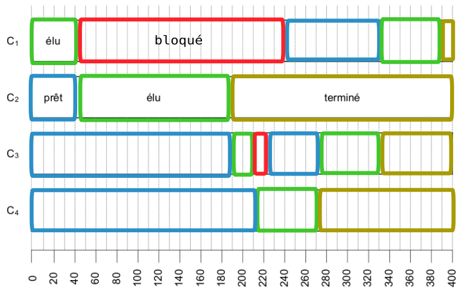

## Exercice 1
_2021, sujet Amérique du Nord_

Un constructeur automobile utilise des ordinateurs pour la conception de ses véhicules.
Ceux-ci sont munis d'un système d'exploitation ainsi que de nombreuses applications parmi lesquelles on peut citer :

- un logiciel de traitement de texte ;
- un tableur ;
- un logiciel de Conception Assistée par Ordinateur (CAO) ;
- un système de gestion de base de données (SGBD)

Chaque ordinateur est équipé des périphériques classiques : clavier, souris, écran et est relié à une imprimante réseau.

1. *(question System On Chip)*
2. Un ingénieur travaille sur son ordinateur et utilise les quatre applications citées au début de l'énoncé.  
Pendant l'exécution de ces applications, des processus mobilisent des données et sont en attente d'autres données mobilisées par d'autres processus.  
On donne ci-dessous un tableau indiquant à un instant précis l'état des processus en cours d'exécution et dans lequel D1, D2, D3, D4 et D5 sont des données.

La lettre M signifie que la donnée est mobilisée par l'application ; la lettre A signifie que l'application est en attente de cette donnée.

Lecture du tableau : le logiciel de traitement de texte mobilise (M) la donnée D1 et est en attente (A) de la donnée D2.

| | D1 | D2 | D3 | D4 | D5|
|:---:|:---:|:---:|:---:|:---:|:---:|
| Traitement de texte | M | A |-|-|-|
| Tableur | A | - |-|-|M|
| SGBD | - | M |A|A|-|
| CAO | - | - |A|M|A|

Montrer que les applications s'attendent mutuellement. Comment s'appelle cette situation ?

??? check "Correction"
    {: .center}
    Le cycle en pointillés montre que les applications s'attendent mutuellement : cette situation s'appelle un interblocage.

## Exercice 2
_2021, Métropole sujet 1_

**Partie A**
Cette partie est un questionnaire à choix mutiples (QCM).
Pour chacune des questions, une seule des quatre réponses est exacte.

1. Parmi les commandes ci-dessous, laquelle permet d’afficher les processus en cours
d’exécution ?
    - a. ```dir```
    - b. ```ps``` 
    - c. ```man``` 
    - d.   ```ls```
2. Quelle abréviation désigne l’identifiant d’un processus dans un système d’exploitation de type UNIX ?
    - a. PIX
    - b. SIG 
    - c. PID 
    - d. SID
3. Comment s'appelle la gestion du partage de processeur entre les différents processus ?
    - a. L'interblocage
    - b. L'ordonnancement
    - c. La planification
    - d. La priorisation
4. Quelle commande permet d’interrompre un processus dans un système d’exploitation de type
UNIX ?
    - a. ```stop```
    - b. ```interrupt``` 
    - c. ```end``` 
    - d.   ```kill```


??? check "correction"
    1. b
    2. c
    3. b
    4. d

**Partie B**

**Q1.** Un processeur choisit à chaque cycle d’exécution le processus qui doit être exécuté. Le
tableau ci-dessous donne pour trois processus P1, P2, P3 :

- la durée d’exécution (en nombre de cycles),
- l’instant d’arrivée sur le processeur (exprimé en nombre de cycles à partir de 0),
- le numéro de priorité.

Le numéro de priorité est d’autant plus petit que la priorité est grande. On suppose qu’à chaque instant, c’est le processus qui a le plus petit numéro de priorité qui est exécuté, ce qui peut provoquer la suspension d’un autre processus, lequel reprendra lorsqu’il sera le plus prioritaire.

{: .center}
Reproduire le tableau ci-dessous sur la copie et indiquer dans chacune des cases le processus
exécuté à chaque cycle.
{: .center}


??? check "correction"
    {: .center}


**Q2.** On suppose maintenant que les trois processus précédents s’exécutent et utilisent une ou plusieurs ressources parmi R1, R2 et R3.
Parmi les scénarios suivants, lequel provoque un interblocage ? Justifier.

{: .center}

??? check "correction"
    {: .center}
    Seul le scenario 2 présente un cycle d'interdépendance : seul le scénario 2 va donc provoquer un interblocage.


## Exercice 3
_2021, Métropole sujet 2_

**Partie A**

Dans un bureau d’architectes, on dispose de certaines ressources qui ne peuvent être utilisées
simultanément par plus d’un processus, comme l’imprimante, la table traçante, le modem.
Chaque programme, lorsqu’il s’exécute, demande l’allocation des ressources qui lui sont
nécessaires. Lorsqu’il a fini de s’exécuter, il libère ses ressources.

{: .center}

On appelle p1, p2 et p3 les processus associés respectivement aux programmes 1, 2 et 3

**Q1.** Les processus s'exécutent de manière concurrente.
Justifier qu'une situation d'interblocage peut se produire.
**Q2.** Modifier l'ordre des instructions du programme 3 pour qu'une telle situation ne puisse pas se produire. Aucune justification n'est attendue.
**Q3.** Supposons que le processus p1 demande la table traçante alors qu'elle est en cours
d'utilisation par le processus p3. Parmi les états suivants, quel sera l'état du processus p1
tant que la table traçante n'est pas disponible :
    - a. élu
    - b. bloqué
    - c. prêt
    - d. terminé


**Partie B**

Avec une ligne de commande dans un terminal sous Linux, on obtient l'affichage suivant :

{: .center}

La documentation Linux donne la signification des différents champs :

- `UID` : identifiant utilisateur effectif ;
- `PID` : identifiant de processus ;
- `PPID` : `PID` du processus parent ;
- `C` : partie entière du pourcentage d'utilisation du processeur par rapport au temps de vie
des processus ;
- `STIME` : l'heure de lancement du processus ;
- `TTY` : terminal de contrôle
- `TIME` : temps d'exécution
- `CMD` : nom de la commande du processus


**Q1.** Parmi les quatre commandes suivantes, laquelle a permis cet affichage ?

- a. ```ls -l``` 
- b. ```ps -ef``` 
- c. ```cd ..``` 
- d. ```chmod 741 processus.txt``` 

**Q2.** Quel est l'identifiant du processus parent à l'origine de tous les processus concernant le
navigateur Web (chromium-browser) ?

**Q3.** Quel est l'identifiant du processus dont le temps d'exécution est le plus long ?


??? check "correction"
    **Q1.** b.

    **Q2.** 6211

    **Q3.** 6211

## Exercice 4
_2021, Métropole Candidats Libres sujet 2_

**Q1.** Les états possibles d’un processus sont : *prêt*, *élu*, *terminé* et *bloqué*.

**Q1.a.** Expliquer à quoi correspond l’état *élu*.  
**Q1.b.** Proposer un schéma illustrant les passages entre les différents états.

**Q2.** On suppose que quatre processus C₁, C₂, C₃ et C₄ sont créés sur un ordinateur,
et qu’aucun autre processus n’est lancé sur celui-ci, ni préalablement ni pendant
l’exécution des quatre processus.
L’ordonnanceur, pour exécuter les différents processus prêts, les place dans une
structure de données de type file. Un processus prêt est enfilé et un processus
élu est défilé.

??? check "correction"
    **Q1a.** Élu signifie que le processus est actuellement en cours d'exécution par le processeur.

    **Q1b.** 
    {: .center}


    


**Q2.a.** Parmi les propositions suivantes, recopier celle qui décrit le fonctionnement
des entrées/sorties dans une file :  

- i.Premier entré, dernier sorti
- ii. Premier entré, premier sorti
- iii. Dernier entré, premier sorti

??? check "correction"
    **Q2a.** ii. Premier entré, premier sorti


**Q2.b.** On suppose que les quatre processus arrivent dans la file et y sont placés
dans l’ordre C₁, C₂, C₃ et C₄.

- Les temps d’exécution totaux de C₁, C₂, C₃ et C₄ sont respectivement
100 ms, 150 ms, 80 ms et 60 ms.
- Après 40 ms d’exécution, le processus C₁ demande une opération d’écriture
disque, opération qui dure 200 ms. Pendant cette opération d’écriture, le
processus C₁ passe à l’état bloqué.
- Après 20 ms d’exécution, le processus C₃ demande une opération d’écriture
disque, opération qui dure 10 ms. Pendant cette opération d’écriture, le
processus C₃ passe à l’état bloqué.


Sur la frise chronologique ci-dessous, les
états du processus C₂ sont donnés. Compléter la frise avec les états des
processus C₁, C₃ et C₄.

{: .center}

??? check "correction"
    {: .center}
    
# Exercice 2 du sujet Métropole J1 2025 (6 points) 

Exercice 2 du sujet [Métropole J1 2025](../../T6_Annales/data/2025/25_NSIJ1ME1.pdf){. target="_blank"}

*Cet exercice porte sur l'algorithmique, les structures de données, et la gestion de processus.*

On cherche à créer une application de type *liste des tâches à faire* pour aider Alice à planifier sa journée. Pour cela Alice saisit les informations concernant chacune des tâches qu'elle doit effectuer : elle indique un nom pour la tâche, ainsi que la durée qu'elle estime nécessaire afin de la réaliser. On représente une tâche saisie par Alice à l'aide d'un objet de type `Tache`, muni de quatre attributs :

- le `numero` de la tâche, saisi par Alice ;
- le `nom` de la tâche, saisi par Alice ;
- la `duree` (un entier exprimé en minute) nécessaire à la réalisation de la tâche saisie par Alice ;
- la `duree_restante` (un entier exprimé en minute) avan la fin de la tâche. Cet attribut sera initialisé avec la durée totale nécessaire à la réalisation de la tâche.

Avancer de `n` minutes (`n` entier positif) dans une tâche consiste à diminuer de `n` la durée restante de cette tâche. Une tâche est terminée si la durée restante est négative ou nulle.

Lors de la phase de planification des tâches (aucune d'entre elles n'est commencée), Alice liste les tâches suivantes qui doivent être effectuées

| Numéro | Nome                                | Durée | Durée restante |
| ------ | ----------------------------------- | ----- | -------------- |
| 1      | Répondre aux e-mails                | 45    | 45             |
| 2      | Ranger ma chambre                   | 60    | 60             |
| 3      | Réviser la NSI                      | 90    | 90             |
| 4      | S'entraîner aux échecs              | 30    | 30             |
| 5      | Apprendre le vocabulaire de chinois | 30    | 30             |
| 6      | Lire Fondation                      | 60    | 60             |
| 7      | Écrire ma lettre au Père Noël       | 20    | 20             |

On dispose de la classe `Tache` ci-dessous pour représenter les tâches :

```python
class Tache:
    def __init__(self, numero, nom, duree):
        self.numero = numero
        self.nom = nom
        self.duree_initiale = duree
        self.duree_restante = duree
        
    def __repr__(self):
        return '<t' + str(self.numero) + '>'
```

1_ Donner le code Python qui permet d'instancier deux variables `tache1` et `tache2` représentant les tâches : 
- tâche numéro 1 : Répondre aux e-mails. Durée estimée : 45 minutes.
- tâche numéro 2 : Ranger ma chambre. Durée estimée : 60 minutes.

??? check "correction"

    ```python
    tache1 = Tache(1, "Répondre aux e-mails", 45)
    tache2 = Tache(2, "Ranger ma chambre", 60)
    ```

On supposera dans la suite que les variables `tache1`, `tache2`, ..., `tache7` représentent les tâches établies par Alice lors de la phase de planification.

La méthode `__repr__` reenvoie une représentation de l'instance sous forme d'une chaîne de caractères. La fonction `print` utilise cette méthode. Ainsi on a : 

```python
>>> print(tache1)
<t1>
```
2_ Recopier et compléter le code de la méthode `avancer` de la classe `Tache` qui permet d'avancer la tâche `self` de `n` minutes.
```python
def avancer(self, n):
    ...
```
??? check "correction"

    ```python
    def avancer(self, n):
        self.duree_restante -= n
```


3_ Recopier et compléter le code de la méthode `est_terminee` de la classe `Tache` qui renvoie `True` si la tâche est terminée, ou `False` sinon.
```python
def est_terminee(self):
    ...
```
??? check "correction"

    ```python
    def est_terminee(self):
        return self.duree_restante <= 0
    ```

Afin d'aider Alice à planifier sa journée, on lui propose d'associer à chacune des tâches une priorité. La priorité d'une tâche est représentée par un entier de la manière suivante : 1 est la priorité minimale et, plus le nombre est grand, plus la tâche associée est prioritaire.

Pour stocker toutes les tâches à effectuer, on utilise une file, dans laquelle les éléments sont des tuples `(tache, priorite)`. Les éléments stockés dans la file doivent respecter les deux conditions ci-après.
- **Condition 1 :** les éléments sont rangés par ordre décroissant de priorité. L'élément de priorité maximale se trouve au début de la file, l'élément le moins prioritaire se trouve à la fin de la file.
- **Condition 2 :** parmi les éléments de même priorité, les éléments sont rangées dans l'ordre dans lequel ils ont été insériées dans la file. Ainsi le premier élémùent de priorité $p$ insréré se trouve devant les éléments de même priorité $p$ insérées plus tard.

Par exemple, si la file de tâches `f` est la file : 
```
[début] (<t3>, 4) (<t1>, 3) (<t2>, 3) (<t4>, 1) (<t5>, 1) [fin]
```
Cela signifie que :
- la tâche de priorité maximale est la tâche numéro 3 ;
- les deux tâches à exécuter en priorité après la tâche numéro 3 sont les tâches numéro 1 et numéro 2. La tâche numéro 1 a été ajoutée à la file des tâches à traiter avant la tâche numéro 2 ;
- il n'y a pas de tâche de priorité 2 ;
- les tâches les moins prioritaires de la file sont les tâches numéro 4 et numéro 5. la tâche numéro 4 a été ajoutée avant la tâche numéro 5.

4_ Représenter l'état de la file `f` lorsqu'on lui ajoute successivement la tâche numéro 6 avec la priorité 2, puis la tâche numéro 7 avec la priorité 4 en respectant les conditions 1 et 2 décrites ci-dessus.

??? check "correction"

    ```
    [début] (<t3>, 4) (<t7>, 4) (<t1>, 3) (<t2>, 3) (<t6>, 2) (<t4>, 1) (<t5>, 1) [fin]
    ```


On suppose déjà définies les méthodes suivantes pour la classe `File` :
- `File()` crée et renvoie un objet de type `File`, vide. 
- `enfiler(self, e)` : ajoute l'élément `e`à la fin de la file `f`.
- `defiler(self)` : renvoie, en le supprimant de la file, le premier élément de la file si cela est possible.
- `examiner(self)` : renvoie, sans le supprimer de la file, le premier élément de la file si cela est possible.
- `est_vide(self)` : renvoie `True` si la file est vide, ou `False` sinon.

5_ En repartant de la file `f` suivante :
```
[début] (<t3>, 4) (<t1>, 3) (<t2>, 3) (<t4>, 1) (<t5>, 1) [fin]
```
donner la valeur de `f.defiler()[0]`, et représenter le contenu de la file `f` après l'exécution de cette instruction.

??? check "correction"

    `f.defiler()` vaut `(tache3, 4)`, ainsi `f.defiler()[0]` vaut `tache3`... donc évalué par `__repr__` en `<t3>`.
    Après exécution de cette instruction `f` vaut 
    ```
    [début] (<t1>, 3) (<t2>, 3) (<t4>, 1) (<t5>, 1) [fin]
    ```


6_ En repartant de la file `f` suivante :
```
[début] (<t3>, 4) (<t1>, 3) (<t2>, 3) (<t4>, 1) (<t5>, 1) [fin]
```
donner la valeur de `f.examiner()[1]`, et représenter le contenu de la file `f` après l'exécution de cette instruction.

??? check "correction"

    `f.examiner()` vaut `(tache3, 4)`, ainsi `f.examiner()[1]` vaut `4`.
    Après exécution de cette instruction `f` ne change pas et vaut 
    ```
    [début] (<t3>, 4) (<t1>, 3) (<t2>, 3) (<t4>, 1) (<t5>, 1) [fin]
    ```

On souhaite écrire une fonction `ajouter_file_prio` qui prend en paramètres : 

- une file `f` dont les éléments sont des tuples `(tache, priorite)` respectant les deux conditions de l'énoncé ;
- une tâche `t` ;
- la priorité `p` de la tâche `t` ;
et qui ajoute le tuple `(t, p)`à la bonne position dans la file `f`.

On utilise une file auxilliaire `f_aux` que l'on remplit en défilant les éléments en début de file `f`tant que la priorité du premier élément de la file est supérieure ou égale à `p`. Puis on enfile l'élément `(t, p)`dans la file auxilliaire. on défile ensuite tous les éléments restants de `f` dans `f_aux` et enfin on enfile dans `f` tous les éléments de `f_aux`.

7_ Recopier et compléter le code de la fonction `ajouter_file_prio`.
```python
def ajouter_file_prio(f, t, p):
    f_aux = File()
    while ...:
        ...
    ...enfiler(...)
    while not ...:
        ...
    while not ...:
        ...
```
??? check "correction"

    ```python
    def ajouter_file_prio(f, t, p):
        f_aux = File()
        while not f.est_vide and f.examiner()[1] >= p:
            f_aux.enfiler(f.defiler())
        f_aux.enfiler((t,p))
        while not f.est_vide():
            f_aux.enfiler(f.defiler())
        while not f_aux.est_vide():
            f.enfiler(f_aux.depiler())
    ```


8_ Donner le coût d'exécution temporel dans le pire des cas de la fonction `ajouter_file_prio`, en fonction du nombre d'éléments `m` de la file `f`.

??? check "correction"

    Le coût est linéaire.

Une fois qu'Alice a entré toutes les tâches qu'elle doit effectuer, leur durée estimée, ainsi que la priorité à laquelle elle doit les effectuer, l'application lui propose un planning en utilisant la technique dite Pomodoro :

- la tâche à effectuer est la tâche qui se trouve en tête de file ;
- on défile cette tâche de la file des tâches à effectuer ;
- on avance cette tâche de 25 minutes ;
- si cette tâche n'est pas terminée, on rajoute cette tâche dans la file des tâches à effectuer, avec la même priorité qu'initialement (en utilisant la fonction `ajouter_file_prio`) ; 
- si cette tâche se termine au cours des 25 minutes, alors Alice attend la fin des 25 minutes en se reposant ;
- on continue ces étapes tant que la file des tâches à effectuer n'est pas vide.

On rappelle les tâches à effectuer ci-dessous, classées par ordre de priorité. On considérera que les tâches sont ajoutées à la file de priorité dans l'ordre du tableau ci-dessous : 

| Numéro | Nome                                | Durée | Durée restante |
| ------ | ----------------------------------- | ----- | -------------- |
| 3      | Réviser la NSI                      | 90    | 90             |
| 7      | Écrire ma lettre au Père Noël       | 20    | 20             |
| 1      | Répondre aux e-mails                | 45    | 45             |
| 2      | Ranger ma chambre                   | 60    | 60             |
| 6      | Lire Fondation                      | 60    | 60             |
| 4      | S'entraîner aux échecs              | 30    | 30             |
| 5      | Apprendre le vocabulaire de chinois | 30    | 30             |

9_ Indiquer pour chaque bloc de 25 minutes la tâche qui avance, en suivant le modèle proposé, jusqu'à la fin de toutes les tâches.
On fera particulièrement attention au cas où la tâche n'est pas terminée : celle-ci est rajoutée à la file des tâches à effectuer (dont elle avait été supprimée) avec la même priorité qu'initialement, en respectant les conditions 1 et 2 de l'énoncé.

??? check "correction"

    L'ordre d'exécution est le suivant :
    ```
    t3, t7, t3, t3, t3, t1, t2, t1, t2, t2, t6, t6, t6, t4, t5, t4, t5

    ```


10_ Écrire le code d'une fonction `planning` qui prend en paramètre une file de priorité `f`donbc les éléments sont des tuples `(tache, prio)`, et qui renvoie une liste de tâches, dans l'ordre dans lequel elles vont être effectuées par tranche de 25 minutes avec la méthode Pomodoro.

Par exemple, si `tache1`, `tachg2` et `tache3` soint les tâches numéro 1, numéro 2 et numéro 3, alors le programme suivant :

```python
file = File()
for t,p in [(tache1, 3), (tache2, 3), (tache3, 4)]:
    ajouter_file_prio(file, t, p)
print(planning(file))
```

produit l'affichage :
```
[<t3>, <t3>, <t3>, <t3>, <t1>, <t2>, <t1>, <t2>, <t2>]
```

??? check "correction"

    L'ordre d'exécution est le suivant :
    ```python=
    def planning(f):
        ordre = []
        while not f.est_vide():
            tache, prio = f.defiler()
            ordre.append(tache)
            tache.avancer(25)
            if not tache.est_terminee():
                ajouter_file_prio(file, tache, prio)
        return ordre
    ```