# Révision Liste/Pile/File

!!! info "Crédits"
    - Crédit de la mise en pages des exercices  : [Gilles Lassus](https://glassus.github.io)
    - Sujet 2022, Centres étrangers, J1, Ex. 2 Mise en page par Franck Chambon
    - Sujet 2022, Métropole, J1, Ex. 1 Mise en page et correction par [Franck Chambon](https://e-nsi.gitlab.io/ecrit/)
    - Sujet 2022, Polynésie, J1, Ex. 4 Mise en page et correction par [Franck Chambon](https://e-nsi.gitlab.io/ecrit/)
    - Sujet 2022, Métropole, J2, Ex. 2 Mise en page et correction par [Nicolas Revéret](https://e-nsi.gitlab.io/ecrit/)
    
## Passage automatique en caisse

> D'après 2022, Centres étrangers, J1, Ex. 2

Un supermarché met en place un système de passage automatique en caisse. Un client scanne les articles à l'aide d'un scanner de code-barres au fur et à mesure qu'il les ajoute dans son panier.

Les articles s'enregistrent alors dans une structure de données. La structure de données utilisée est une file définie par la classe `Panier`, avec les primitives habituelles sur la structure de file.

Pour faciliter la lecture, le code de la classe `Panier` n'est pas écrit.

```python
class Panier():
    def __init__(self):
        "Initialise la file comme une file vide."

    def est_vide(self):
        "Renvoie True si la file est vide, False sinon."

    def enfile(self, e):
        "Ajoute l'élément e en dernière position de la file, ne renvoie rien."

    def defile(self):
        "Retire le premier élément de la file et le renvoie."
```

Le panier d'un client sera représenté par une file contenant les articles scannés.

Les articles sont représentés par des tuples `(code_barre, designation, prix, horaire_scan)` où

* `code_barre` est un nombre entier identifiant l'article ;
* `designation` est une chaine de caractères qui pourra être affichée sur le ticket de caisse ;
* `prix` est un nombre décimal donnant le prix d'une unité de cet article ;
* `horaire_scan` est un nombre entier de secondes permettant de connaitre l'heure où l'article a été scanné.

**1.** On souhaite ajouter un article dont le tuple est le suivant `(31002, "café noir", 1.50, 50525)`.

Écrire le code utilisant une des quatre méthodes ci-dessus permettant d'ajouter l'article à l'objet de classe `Panier` appelé `panier_1`.

??? success "Réponse"
    `#!py panier_1.enfile((31002, "café noir", 1.50, 50525))`


**2.** On souhaite définir une méthode `remplir` de paramètre `panier_temp` dans la classe `Panier` permettant de transférer vers la file tout le contenu d'un autre panier `panier_temp` qui est aussi un objet de type `Panier`. Recopier et compléter le code de la méthode `remplir`.

```python
def remplir(self, panier_temp):
    while not panier_temp. ... :
        article = panier_temp. ...
        self. ... (article)
```

??? success "Réponse"

    ```python
    def remplir(self, panier_temp):
        while not panier_temp.est_vide():
            article = panier_temp.defile()
            self.enfile(article)
    ```

**3.** Pour que le client puisse connaitre à tout moment le montant de son panier, on souhaite ajouter une méthode `prix_total` (sans paramètres) à la classe `Panier` qui renvoie la somme des prix de tous les articles présents dans le panier.

Écrire le code de la méthode `prix_total`.

:warning: Attention, après l'appel de cette méthode, le panier devra toujours contenir ses articles.

??? success "Réponse"

    ```python
    def prix_total(self):
        cumul = 0
        panier_temp = Panier()

        while not self.est_vide():
            article = self.defile()
            code_barre, designation, prix, horaire_scan = article
            # ou alors prix = article[2]
            cumul += prix
            panier_temp.enfile(article)

        while not panier_temp.est_vide():
            article = panier_temp.defile()
            self.enfile(article)

        return cumul
    ```

**4.** Le magasin souhaite connaitre pour chaque client la durée du passage en caisse. Cette durée sera obtenue en faisant la différence entre le champ `horaire_scan` du dernier article scanné et le champ `horaire_scan` du premier article scanné dans le panier du client. Un panier vide renverra une durée égale à `None`. On pourra accepter que le panier soit vide après l'appel de cette méthode.

Écrire une méthode `duree_passage_en_caisse` de la classe `Panier` qui renvoie cette durée.

??? success "Réponse"

    ```python
    def duree_passage_en_caisse(self):
        if self.est_vide():
            return None
        else:
            article = self.defile()
            code_barre, designation, prix, horaire_scan = article
            h_mini = h_maxi = horaire_scan

            while not self.est_vide():
                article = self.defile()
                code_barre, designation, prix, horaire_scan = article
                if horaire_scan > h_maxi:
                    h_maxi = horaire_scan
                if horaire_scan < h_mini:
                    h_mini = horaire_scan
        
        return h_maxi - h_mini
    ```

    Si on est certain que la file est dans l'ordre croissant des horaires de scan, on peut proposer le code plus simple

    ```python
    def duree_passage_en_caisse(self) :
        if self.est_vide() :
            return None
        else :
            article = self.defile()
            debut = article[3]
            while not self.est_vide() :
                article = self.defile()
            duree = article[3] - debut
            return duree
    ```


## Vérification syntaxique de parenthèses ou de balises

> D'après 2022, Métropole, J1, Ex. 1

### Partie A : Expression correctement parenthésée

On veut déterminer si une expression arithmétique est correctement parenthésée.
À chaque parenthèse fermante ")" correspond une parenthèse précédemment ouverte "(".


!!! example "Exemples"
    - L'expression arithmétique `"(2 + 3) × (18/(4 + 2))"` est correctement parenthésée.
    - L'expression arithmétique `"(2 + 3) × (18/(4 + 2"` est non correctement parenthésée.

Pour simplifier les expressions arithmétiques, on enregistre, dans une structure de données, uniquement les parenthèses dans leur ordre d'apparition. On appelle expression simplifiée cette structure.

|  Expression arithmétique  |  Structure de données  |
|---------------------------|------------------------|
|`"(2 + 3) × (18/(4 + 2))"` | `()(())`               |


**1.** Indiquer si la phrase « les éléments sont maintenant retirés (pour être lus) de cette structure de données dans le même ordre qu'ils y ont été ajoutés lors de l'enregistrement » décrit le comportement d'une file ou d'une pile. Justifier.

??? success "Réponse"
    _Le premier à être retiré était le premier à être ajouté_, donc cela correspond à une **file**.


Pour vérifier le parenthésage, on peut utiliser une variable `controleur` qui :

- est un nombre entier égal à 0 en début d'analyse de l'expression simplifiée ;
- augmente de 1 si l'on rencontre une parenthèse ouvrante `"("` ;
- diminue de 1 si l'on rencontre une parenthèse fermante `")"`.

!!! example "Exemple"
    On considère l'expression simplifiée A : `"()(())"`

    Lors de l'analyse de l'expression A, `controleur` (initialement égal à 0) prend successivement pour valeur 1, 0, 1, 2, 1, 0.
    
    Le parenthésage est correct.

**2.** Écrire, pour chacune des 2 expressions simplifiées B et C suivantes, les valeurs successives prises par la variable `controleur` lors de leur analyse.

- Expression simplifiée B : " ((()()"
- Expression simplifiée C : "(()))("


??? success "Réponse"
    - Expression simplifiée B : **1, 2, 3, 2, 3, 2**
    - Expression simplifiée C : **1, 2, 1, 0, -1, 0**

**3.** L'expression simplifiée B précédente est mal parenthésée (parenthèses fermantes manquantes) car le `controleur` est différent de zéro en fin d'analyse.  
L'expression simplifiée C précédente est également mal parenthésée (parenthèse fermante sans parenthèse ouvrante) car le `controleur` prend une valeur strictement négative pendant l'analyse.

Recopier et compléter uniquement les lignes 13 et 16 du code ci-dessous pour que la fonction `parenthesage_correct` réponde à sa description.

```python linenums="1"
def parenthesage_correct(expression):
    """ fonction renvoyant True si l'expression arithmétique
    simplifiée (str) est correctement parenthésée, False sinon.
    Condition: expression ne contient que
      des parenthèses ouvrantes et fermantes
    """
    controleur = 0
    for parenthese in expression:  # pour chaque parenthèse
        if parenthese == '(':
            controleur = controleur + 1
        else:  # parenthese == ')'
            controleur = controleur - 1
            if controleur ... :  # test 1 (à recopier et compléter)
                # parenthèse fermante sans parenthèse ouvrante
                return False
    return controleur ...  # test 2 (à recopier et compléter)
    # test 2 est un booléen renvoyé
    #   True : le parenthésage est correct
    #   False : parenthèse(s) fermante(s) manquante(s)
```

??? success "Réponse"
    - ligne 13: `#!py (controleur < 0)`
    - ligne 16: `#!py (controleur == 0)`

    Les parenthèses sont inutiles.


### Partie B : Texte correctement balisé

On peut faire l'analogie entre le texte simplifié des fichiers HTML (uniquement constitué de balises ouvrantes `#!html <nom>` et fermantes `#!html </nom>`) et les expressions parenthésées.

Par exemple, l'expression HTML simplifiée : `#!html "<p><strong><em></em></strong></p>"` est correctement balisée.

On ne tiendra pas compte dans cette partie des balises ne comportant pas de fermeture comme `#!html <br>` ou `#!html `.

Afin de vérifier qu'une expression HTML simplifiée est correctement balisée, on peut utiliser une pile (initialement vide) selon l'algorithme suivant :

- On parcourt successivement chaque balise de l'expression :

    - lorsque l'on rencontre une balise ouvrante, on l'empile ;
    - lorsque l'on rencontre une balise fermante :
        - si la pile est vide, alors l'analyse s'arrête : le balisage est incorrect,
        - sinon, on dépile et on vérifie que les deux balises (la balise fermante rencontrée et la balise ouvrante dépilée) correspondent (c'est-à-dire ont le même nom) si ce n'est pas le cas, l'analyse s'arrête (balisage incorrect).


#### Exemple détaillé

<table markdown>
  <tr>
    <td>
```html title="Étape 1"
<p><em></p></em>
 ↑
```
    </td>
    <td>
```html title="Étape 2"
<p><em></p></em>
     ↑
```
    </td>
    <td>
```html title="Étape 3"
<p><em></p></em>
         ↑
```
    </td>
  </tr>

  <tr markdown>
État de la pile lors du déroulement de cet algorithme pour l'expression simplifiée

`#!html "<p><em></p></em>"` qui n'est pas correctement balisée :
    <td markdown>
Balise `#!html <p>` ouvrante,</br> on empile.
    </td>
    <td markdown>
Balise `#!html <em>` ouvrante,</br> on empile.
    </td>
    <td markdown>
Balise `#!html </p>` fermante, </br> on dépile, mais...
    </td>
  </tr>

  <tr>
    <td>
```html title="Pile"
.
.         ↙
.
<p>
```
    </td>
    <td>
```html title="Pile"
.
.         ↙
<em>
<p>
```
    </td>
    <td>
```html title="Pile"
.          <em>
.         ↗
.
<p>
```
    </td>
  </tr>
</table>

`#!html <em>` et `#!html </p>` ne correspondent pas !
Donc le balisage est incorrect.


**4.** Cette question traite de l'état de la pile lors du déroulement de l'algorithme.

**4.a.** Représenter la pile à chaque étape du déroulement de cet algorithme pour l'expression `"<p><em></em></p>"` (balisage correct).

??? success "Réponse"

    === "Départ"

        ```html title="Parcours de l'expression"
        "<p><em></em></p>"
        ↑
        ```

        ```mermaid
        flowchart TD
            A["&nbsp;<br>&nbsp;<br>&nbsp;<br>&nbsp;<br>=====<br>Pile"]
        ```

    === "Étape 1"

        ```html title="Parcours de l'expression"
        "<p><em></em></p>"
          ↑                  Balise  <p>  ouvrante, on empile
        ```
        
        ```mermaid
        flowchart TD
            A["&nbsp;<br>&nbsp;<br>&nbsp;<br>&lt;p&gt;<br>=====<br>Pile"]
        ```

    === "Étape 2"

        ```html title="Parcours de l'expression"
        "<p><em></em></p>"
              ↑              Balise  <em> ouvrante, on empile
        ```
        
        ```mermaid
        flowchart TD
            A["&nbsp;<br>&nbsp;<br>&lt;em&gt;<br>&lt;p&gt;<br>=====<br>Pile"]
        ```

    === "Étape 3"

        ```html title="Parcours de l'expression"
        "<p><em></em></p>"
                  ↑          Balise </em> fermante, on dépile
        ```
        
        ```mermaid
        flowchart TD
            A["&nbsp;<br>&nbsp;<br>&nbsp;<br>&lt;p&gt;<br>=====<br>Pile"]
        ```

        `<#!html em>` et `#!html </em>` se correspondent.

    === "Étape 4"

        ```html title="Parcours de l'expression"
        "<p><em></em></p>"
                       ↑     Balise </p>  fermante, on dépile
        ```
        
        ```mermaid
        flowchart TD
            A["&nbsp;<br>&nbsp;<br>&nbsp;<br>&nbsp;<br>=====<br>Pile"]
        ```

        `#!html <p>` et `#!html </p>` se correspondent.

    === "Fin"

        ```html title="Parcours de l'expression"
        "<p><em></em></p>"
                         ↑
        ```
        
        ```mermaid
        flowchart TD
            A["&nbsp;<br>&nbsp;<br>&nbsp;<br>&nbsp;<br>=====<br>Pile"]
        ```

        La pile est vide. Le balisage est correct.

**4.b.** Indiquer quelle condition simple (sur le contenu de la pile) permet alors de dire que le balisage est correct lorsque toute l'expression HTML simplifiée a été entièrement parcourue, sans que l'analyse ne s'arrête.

??? success "Réponse"
    Il suffirait de vérifier que la pile est **vide**.

**5.** Une expression HTML correctement balisée contient 12 balises.

Indiquer le nombre d'éléments que pourrait contenir au maximum la pile lors de
son analyse.

??? success "Réponse"
    **6 éléments** au maximum seront empilés, dans le cas où 12 balises HTML sont imbriquées. 6 ouvrantes qui seront empilées, puis les 6 fermantes.


## Traitement d'une pile

> D'après 2022, Polynésie, J1, Ex. 4

La classe `Pile` utilisée dans cet exercice est implémentée en utilisant des listes Python et propose quatre éléments d'interface :

- Un constructeur qui permet de créer une pile vide, représentée par `[]` ;
- La méthode `est_vide()` qui renvoie `True` si l'objet est une pile ne contenant aucun élément, et `False` sinon ;
- La méthode `empile` qui prend un objet quelconque en paramètre et ajoute cet objet au sommet de la pile. Dans la représentation de la pile dans la console, cet objet apparait à droite des autres éléments de la pile ;
- La méthode `depile` qui renvoie l'objet présent au sommet de la pile et le retire de la pile.

!!! example "Exemples :"

    ```pycon
    >>> ma_pile = Pile()
    >>> ma_pile.empile(2)
    >>> ma_pile
    [2]
    >>> ma_pile.empile(3)
    >>> ma_pile.empile(50)
    >>> ma_pile
    [2, 3, 50]
    >>> ma_pile.depile()
    50
    >>> ma_pile
    [2, 3]
    ```

La méthode `est_triee` ci-dessous renvoie `True` si, en dépilant tous les éléments, ils sont traités dans l'ordre croissant, et `False` sinon.

```python linenums="1"
def est_triee(self):
    if not self.est_vide():
        e1 = self.depile()
        while not self.est_vide():
            e2 = self.depile()
            if e1 ... e2 :
                return False
            e1 = ...
    return True
```

**1.** Recopier sur la copie les lignes 6 et 8 en complétant les points de suspension.

??? success "Réponse"

    ```python linenums="1"
    def est_triee(self):
        if not self.est_vide():
            e1 = self.depile()
            while not self.est_vide():
                e2 = self.depile()
                if e1 > e2 :
                    return False
                e1 = e2
        return True
    ```


On crée dans la console la pile `A` représentée par `[1, 2, 3, 4]`.

**2.a.** Donner la valeur renvoyée par l'appel `A.est_triee()`.

??? success "Réponse"
    La valeur $4$ est d'abord dépilée, puis $3$. L'ordre n'est pas croissant, ainsi `A.est_triee()` renvoie `False`.

**2.b.** Donner le contenu de la pile `A` après l'exécution de cette instruction.

??? success "Réponse"

    `A` sera représenté par `[1, 2]`.

On souhaite maintenant écrire le code d'une méthode `depile_max` d'une pile non vide ne contenant que des nombres entiers et renvoyant le plus grand élément de cette pile en le retirant de la pile.

Après l'exécution de `p.depile_max()`, le nombre d'éléments de la pile `p` diminue donc de 1.


```python linenums="1"
def depile_max(self):
    assert not self.est_vide(), "Pile vide"
    q = Pile()
    maxi = self.depile()
    while not self.est_vide():
        elt = self.depile()
        if maxi < elt:
            q.empile(maxi)
            maxi = ...
        else :
            ...
    while not q.est_vide():
        self.empile(q.depile())
    return maxi
```

**3.** Recopier sur la copie les lignes 9 et 11 en complétant les points de suspension.

??? success "Réponse"

    ```python linenums="1"
    def depile_max(self):
        assert not self.est_vide(), "Pile vide"
        q = Pile()
        maxi = self.depile()
        while not self.est_vide():
            elt = self.depile()
            if maxi < elt:
                q.empile(maxi)
                maxi = elt
            else :
                q.empile(elt)
        while not q.est_vide():
            self.empile(q.depile())
        return maxi
    ```


On crée la pile `B` représentée par `[9, -7, 8, 12, 4]` et on effectue l'appel `B.depile_max()`.

**4.a.** Donner le contenu des piles `B` et `q` à la fin de chaque itération de la boucle `#!py while` de la ligne 5.

??? success "Réponse"
    === "Initialisation"
        - `B` contient `[9, -7, 8, 12]` ;
        - `q` est vide ;
        - `maxi` est égal à `4`.

        Juste avant le premier tour de boucle

    === "Fin du tour 1"
        - `B` contient `[9, -7, 8]` ;
        - `q` contient `[4]` ;
        - `maxi` est égal à `12`.

    === "Fin du tour 2"
        - `B` contient `[9, -7]` ;
        - `q` contient `[4, 8]` ;
        - `maxi` est égal à `12`.

    === "Fin du tour 3"
        - `B` contient `[9]` ;
        - `q` contient `[4, 8, -7]` ;
        - `maxi` est égal à `12`.
    
    === "Fin du tour 4"
        - `B` est vide ;
        - `q` contient `[4, 8, -7, 9]` ;
        - `maxi` est égal à `12`.

**4.b.** Donner le contenu des piles `B` et `q` avant l'exécution de la ligne 14.

??? success "Réponse"
    La dernière boucle renverse la pile `q` dans la pile `B`, ainsi, à la ligne 14 :

    - `q` est vide ;
    - `B` contient `[9, -7, 8, 4]`.


**4.c.** Donner un exemple de pile qui montre que l'ordre des éléments restants n'est pas préservé après l'exécution de `depile_max`.

??? success "Réponse"
    Avec une pile `B` qui contient `[3, 1, 2]`

    === "Initialisation"
        - `B` contient `[3, 1]` ;
        - `q` est vide ;
        - `maxi` est égal à `2`.

        Juste avant le premier tour de boucle

    === "Fin du tour 1"
        - `B` contient `[3]` ;
        - `q` contient `[1]` ;
        - `maxi` est égal à `2`.

    === "Fin du tour 2"
        - `B` est vide ;
        - `q` contient `[1, 2]` ;
        - `maxi` est égal à `3`.

    La dernière boucle renverse la pile `q` dans la pile `B`, ainsi, à la ligne 14 :

    - `q` est vide ;
    - `B` contient `[2, 1]`.

    Sans `3` dans la pile `B` initiale, on a dans l'ordre `[1, 2]` ce qui est différent de `[2, 1]` obtenu ici avec `depile_max`.

    On a ainsi un exemple où l'ordre des éléments restants n'est pas préservé après l'exécution de `depile_max`.


On donne le code de la fonction `traite` :

```python linenums="1"
def traite(self):
    q = Pile()
    while not self.est_vide():
        q.empile(self.depile_max())
    while not q.est_vide():
        self.empile(q.depile())
```

**5.a.** Donner les contenus successifs des piles `B` et `q`

- avant la ligne 3,
- avant la ligne 5,
- à la fin de l'exécution de la fonction `traite` lorsque la fonction `traite` est appelée avec la pile `B` contenant `[1, 6, 4, 3, 7, 2]`.

??? success "Réponse"
    Avec `B = [1, 6, 4, 3, 7, 2]`, un appel `B.traite()` conduit successivement à :

    - Avant la ligne 3,
        - `B` contient `[1, 6, 4, 3, 7, 2]` ;
        - `q` est vide.
    - Avant la ligne 5,
        - `B` est vide ;
        - `q` contient `[7, 6, 4, 3, 2, 1]`
    - À la fin,
        - `B` contient `[1, 2, 3, 4, 6, 7]`
        - `q` est vide.

**5.b.** Expliquer le traitement effectué par cette méthode.

??? success "Réponse"
    Ce traitement est un tri de la pile. On construit d'abord `q` comme la pile des éléments de `self` dans l'ordre décroissant. On renverse ensuite la pile, qui se retrouve comme si on avait empilé les éléments de `self` dans l'ordre croissant.

    Attention, il s'agit de l'ordre inverse de celui proposé par la fonction `est_triee` vu à la question **1**. ici, si on dépile les éléments, ils sont désormais dans l'ordre décroissant.

## Jeu de la poussette

> D'après 2022, Métropole, J2, Ex. 2

La poussette est un jeu de cartes en solitaire. Cet exercice propose une version simplifiée de ce jeu basée sur des nombres.

On considère une pile constituée de nombres entiers tirés aléatoirement. Le jeu consiste à réduire la pile suivant la règle suivante : quand la pile contient du haut vers le bas un triplet dont les termes du haut et du bas sont de même parité, on supprime l'élément central.

Par exemple :

* Si la pile contient du haut vers le bas le triplet 1 ; 0 ; 3, on supprime le 0, car 1 et 3 sont tous les deux impairs.
* Si la pile contient du haut vers le bas le triplet 1 ; 0 ; 8, la pile reste inchangée, car 1 et 8 n'ont pas la même parité.
  
On parcourt la pile ainsi de haut en bas et on procède aux réductions.

Arrivé en bas de la pile, **on recommence la réduction** en repartant du sommet de la pile jusqu'à ce que la pile ne soit plus réductible.

Une partie est « gagnante » lorsque la pile finale est réduite à deux éléments exactement.

Voici un exemple détaillé de déroulement d'une partie.

=== "Premier parcours de la pile"

    { .autolight }
    { .autolight }
    { .autolight }
    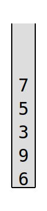{ .autolight }

    * La première comparaison (7, 5 et 4) laisse la pile inchangée.
    * On retire le 4 lors de la deuxième itération.
    * On retire le 8 lors de la troisième.
    * Il ne reste plus que deux valeurs en bas de la pile (9 et 6) : on a fini le premier parcours.

=== "Deuxième parcours"

    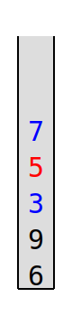{ .autolight }
    { .autolight }
    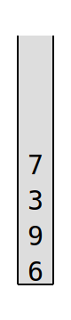{ .autolight }

    * On recommence à partir du haut de la pile : on retire le 5.
    * Le triplet suivant (3, 9 et 6) n'entraine pas de suppression.
    * Il ne reste plus que deux valeurs à étudier (9 et 6) : on a terminé le deuxième parcours.

=== "Troisième parcours"

    { .autolight }
    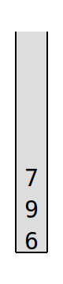{ .autolight }

    * On recommence en haut de la pile avec 7, 3 et 9 : on retire le 3.
    * Il ne reste que le 9 et le 6 : on a terminé le troisième parcours.

=== "Quatrième parcours"

    { .autolight }

    * On recommence en haut de la pile avec 7, 9 et 6. La pile est inchangée.
    * La pile n'a pas été modifiée lors de ce parcours : la partie est terminée et cette pile n'est pas gagnante.

**1.a.** Donner les différentes étapes de réduction de la pile suivante :

{ .autolight }

??? success "Réponse"

    Il s'agit d'une pile gagnante :

    === "Premier parcours"

        { .autolight }
        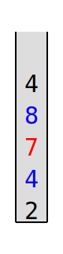{ .autolight }
        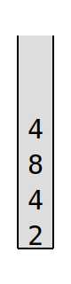{ .autolight }
        
        * Lors de la première comparaison, on retire le 9.
        * Lors de la seconde comparaison, on retire le 7.
        * Il ne reste plus que deux valeurs en bas de la pile (4 et 2) : on a fini le premier parcours.

    === "Second parcours"

        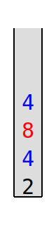{ .autolight }
        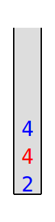{ .autolight }
        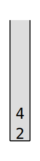{ .autolight }
        
        * Lors de la première comparaison, on retire le 8.
        * Lors de la seconde comparaison, on retire le 4.
        * Il ne reste plus que deux valeurs en bas de la pile (4 et 2) : la pile est gagnante.

**1.b.** Parmi les piles proposées ci-dessous, donner celle qui est gagnante.

=== "Pile A"
    
    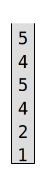{ .autolight }
        
=== "Pile B"
    
    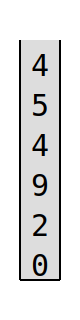{ .autolight }
        
=== "Pile C"
    
    { .autolight }
    
??? success "Réponse"

    Seule la pile B est gagnante. On fournit ci dessous les piles en début et fin de partie :

    === "Pile A"
        { .autolight }
        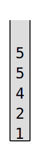{ .autolight }
    
    === "Pile B"
        { .autolight }
        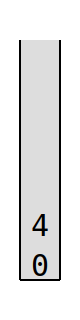{ .autolight }
        
    === "Pile C"
        { .autolight }
        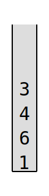{ .autolight }

L'interface d'une pile est proposée ci-dessous :

* `pile_vide()` renvoie une pile vide, 
* `est_vide(p)` renvoie `True` si `p` est vide, `False` sinon, 
* `empile(p, element)` ajoute `element` au sommet de `p`, 
* `depile(p)` retire l'élément au sommet de `p` et le renvoie, 
* `sommet(p)` renvoie l'élément au sommet de `p` sans le retirer de `p`, 
* `taille(p):` renvoie le nombre d'éléments de `p`.

Dans la suite de l'exercice on utilisera uniquement ces fonctions.

**2.** La fonction `reduit_triplet_au_sommet` permet de supprimer l'élément central des trois premiers éléments en partant du haut de la pile, si l'élément du bas et du haut sont de même parité. Les éléments dépilés et non supprimés sont replacés dans le bon ordre dans la pile.

Recopier et compléter sur la copie le code de la fonction `reduit_triplet_au_sommet` prenant une pile `p` en paramètre et la
modifiant en place. Cette fonction renvoie le booléen `est_reduit` indiquant si le triplet du sommet a été réduit ou non.

```python linenums="1"
def reduit_triplet_au_sommet(p):
    haut = depile(p)
    milieu = depile(p)
    bas = sommet(p)
    est_reduit = ...
    if haut % 2 != ...:
        empile(p, ...)
        ...
    empile(p, ...)
    return ...
```

??? success "Réponse"

    ```python linenums="1"
    def reduit_triplet_au_sommet(p):
        haut = depile(p)
        milieu = depile(p)
        bas = sommet(p)
        est_reduit = True
        if haut % 2 != bas % 2:
            empile(p, milieu)
            est_reduit = False
        empile(p, haut)
        return est_reduit
    ```

**3.** On se propose maintenant d'écrire une fonction `parcourt_pile_en_reduisant` qui parcourt la pile du haut vers le bas en procédant aux réductions pour chaque triplet rencontré quand cela est possible.

La pile est toujours modifiée en place.

La fonction `parcourt_pile_en_reduisant` renvoie un booléen indiquant si la pile a été réduite à au moins une reprise lors du parcours.

**3.a.** Donner la taille minimale que doit avoir une pile pour être réductible.

??? success "Résultat"
    Si une pile a une taille de 2 ou moins, elle n'est pas réductible.

    Si une pile est réductible, alors sa taille est supérieure ou égale à 3.

**3.b.** Recopier et compléter sur la copie :

```python linenums="1"
def parcourt_pile_en_reduisant(p):
    q = pile_vide()
    reduction_pendant_parcours = False
    while taille(p) >= 3:
        if ...:
            reduction_pendant_parcours = ...
        e = depile(p)
        empile(q, e)
    while not est_vide(q):
        ...
        ...
    return ...
```

??? success "Résultat"

    ```python linenums="1"
    def parcourt_pile_en_reduisant(p):
        q = pile_vide()
        reduction_pendant_parcours = False
        while taille(p) >= 3:
            if reduit_triplet_au_sommet(p):
                reduction_pendant_parcours = True
            e = depile(p)
            empile(q, e)
        while not est_vide(q):
            e = depile(q)
            empile(p, e)
        return reduction_pendant_parcours
    ```

**4.** Partant d'une pile d'entiers `p`, on propose ici d'implémenter une fonction récursive `joue` jouant une partie complète sur la pile `p`.

On effectue donc autant de parcours que nécessaire.

Une fois la pile parcourue de haut en bas, on effectue un nouveau parcours à condition que le parcours précédent ait modifié la pile. Si à l'inverse, la pile n'a pas été modifiée, on ne fait rien, car la partie est terminée.

```python linenums="1"
def joue(p):
    if parcourt_pile_en_reduisant(...):
        ...(...)
```

??? success "Résultat"

    ```python linenums="1"
    def joue(p):
        if parcourt_pile_en_reduisant(p):
            joue(p)
    ```
