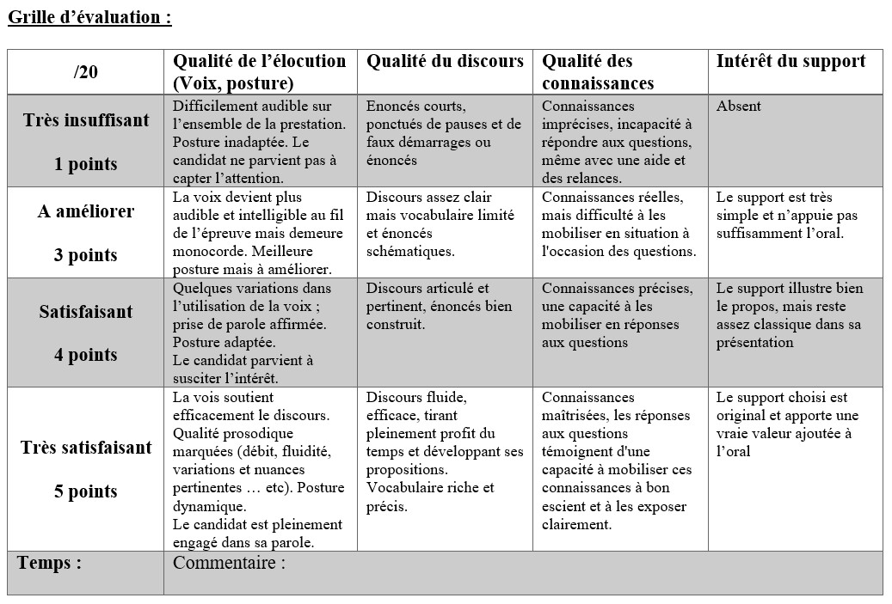

# Exposé Crypto 🔐

!!! danger "Consignes"
    Préparer un exposé individuellement pour une durée de 7 minutes sur un algorithme de cryptographie. 
    La présentation se fera avec une démonstration de l'algorithme et une contextualisation de celui ci dans une diaporama léger. L'oral devra se faire sans note. 
    Une séance de question/réponse aura lieu en fin d’exposé. 
    Une liste des sources devra être fournie en fin d’exposé. 

- 🔒 23/03 : Morgane
- 🔒 23/03 : Simon
- 🔒 23/03 : Andres
- 🔒 23/03 : Maxime
- 🔒 23/03 : Diwann
- 🔒 23/03 : Baptiste
- 🔒 24/03 : mouslim
- 🔒 24/03 : Mathias
- 🔒 24/03 : Nadège
- 🔒 24/03 : Nataël
- 🔒 24/03 : Yaniss

**Suggestions :**

- Chiffrement de Playfair - **morgane**
- Chiffrement de Hill - **simon**
- Chiffrement par transposition rectangulaire - **andres**
- Chiffrement de Vernam - **maxime**
- Masque jetable (One-Time Pad)
- Chiffrement par rail fence (zigzag) - **diwann**
- Principes de stéganophaphie - **nadege**
- HTTPS et le protocole TLS - **Mathias**
- principes de Signature numérique
- Cryptographie et Seconde Guerre mondiale (machine Enigma) - **Baptiste**
- Les cryptomonnaies et la blockchain - **nataël**
- Cryptographie post-quantique
- Cryptanalyse moderne (Attaques par force brute, analyse fréquentielle, attaques par canal auxiliaire) - **yaniss**
- Gestion et stockage sécurisé des mots de passe (Salage, étirement de clé, bonnes pratiques actuelles) - **Mouslim**