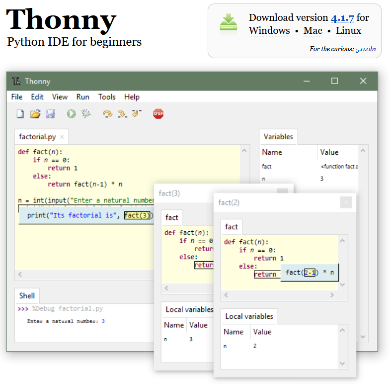
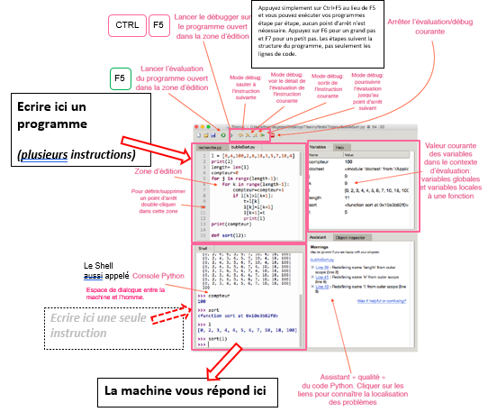
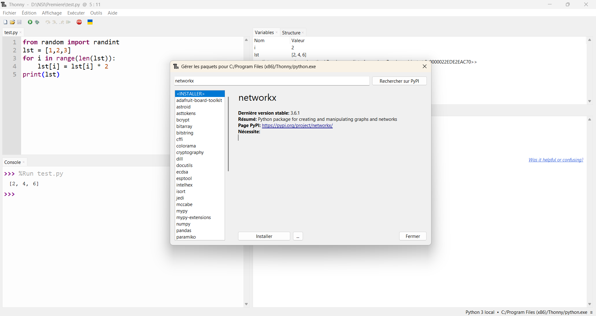

# Découverte de Thonny

!!! info "Crédit"
    document source : Didier Berhault, Lycée Marcellin Berthelot, Questembert

Pour aborder les bases de Python, vous utiliserez cet IDE au style épuré et aux fonctions très pédagogiques.
Thonny est déjà installé sur les ordinateurs du lycée.

Source officielle du téléchargement : [https://thonny.org](https://thonny.org)

{: .center width=50%}

!!! note "Affichage personnalisé"
    Affichage personnalisable : menu « affichage »

    Les fenêtres à activer une fois Thonny installé et ouvert : Assistant, Console, Structure, Variables

## Les zones et boutons de Thonny

{: .center width=80%}

## Installer une bibliothèque

Dans le menu Outils > Gérer les paquets, Taper le nom de la bibliothèque (exemple ici : networkx), Cliquer sur « Rechercher sur PyPi » puis Cliquer sur le premier lien proposé  **networkx**, Cliquer sur le bouton « Installer »

{: .center width=100%}

Si la bibliothèque existe déjà, vous pouvez « mettre à jour » (fortement conseillé) ou « désinstaller »
